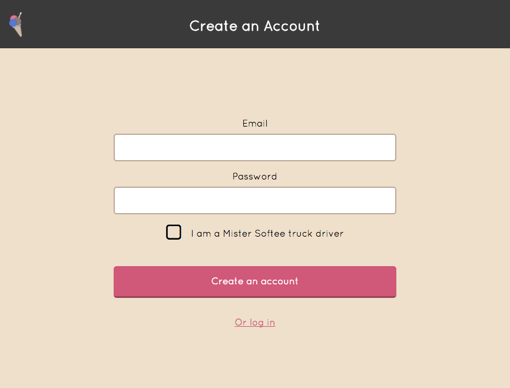
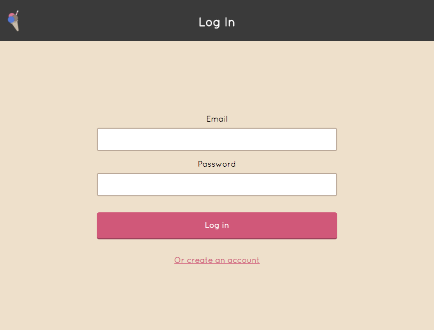
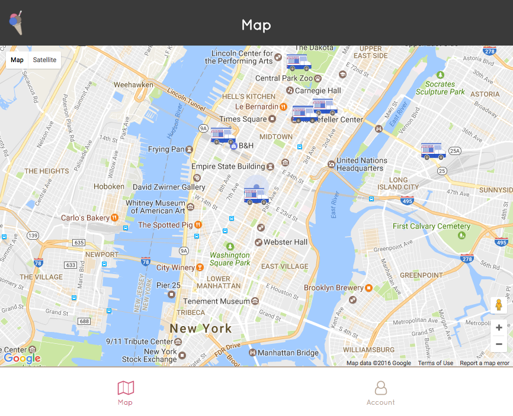
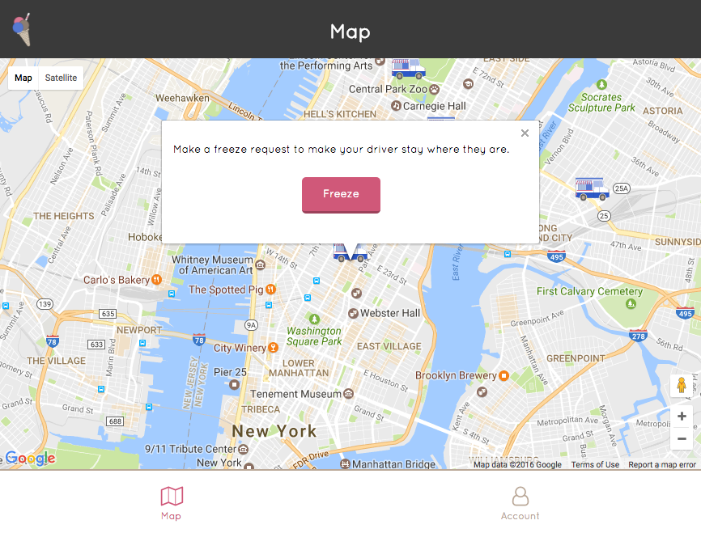
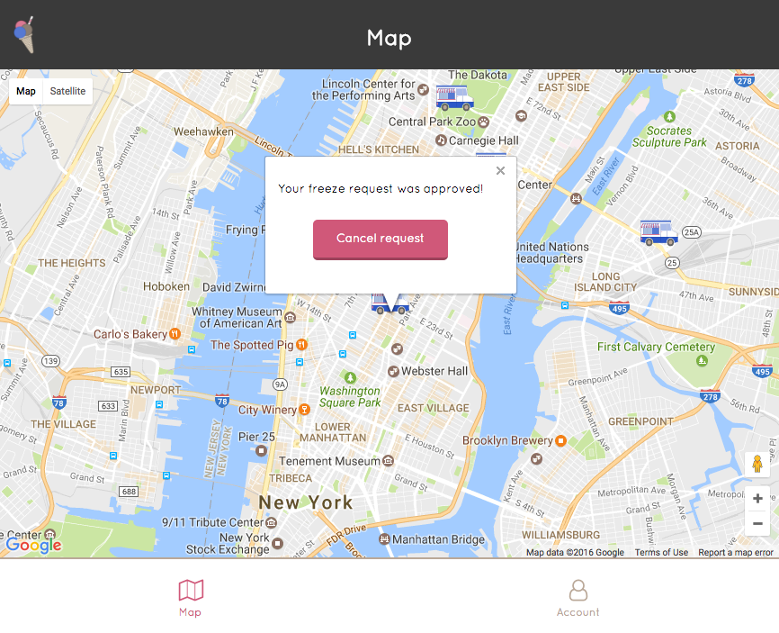
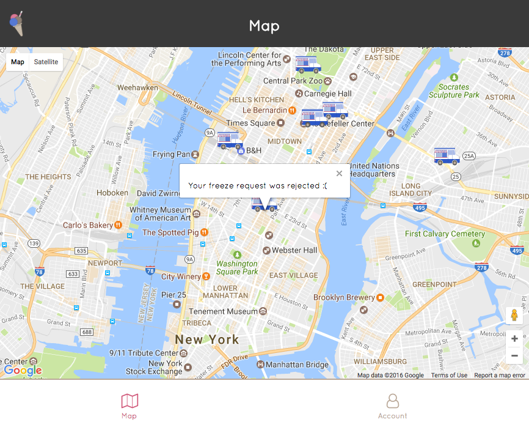
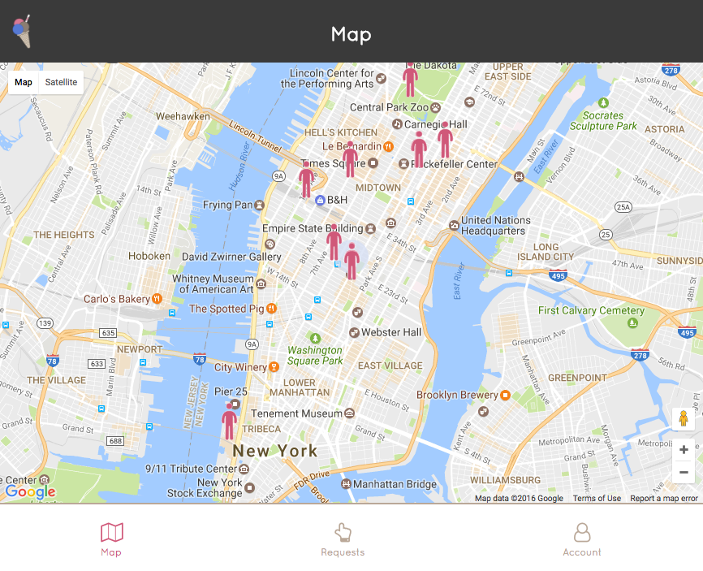
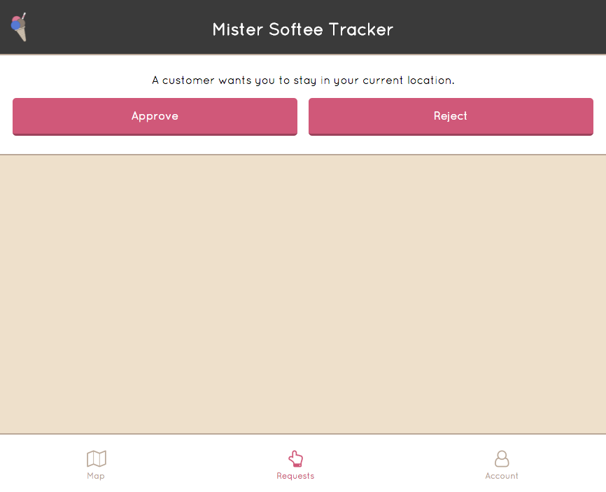
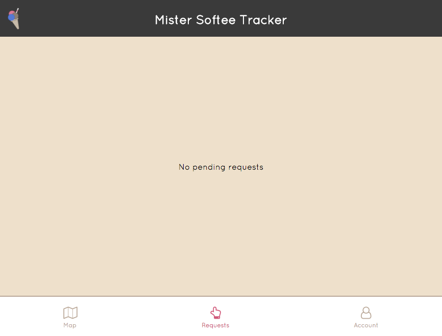

# Mister Softee Tracker

Live: https://mister-softee-tracker-client.herokuapp.com/

Everybody in New York knows the jingle of the Mister Softee ice cream trucks, though spotting one can feel like finding a unicorn. This app allows people to see real-time locations of Mister Softee trucks and make requests to drivers, while also allowing drivers to sign in and see where potential customers are.

This repo is the client app that I built using React and Redux. The Rails API that I built to handle the data for this app is located here: https://github.com/erikwithuhk/mister-softee-tracker-api.

## Installation Instructions

Clone the repository to your local machine, and run `npm install` from directory in the shell to install the project dependencies.

## Usage Instructions

Run `npm start` from the directory in the shell to start the server in Node.

## User Flow

#### Logged-Out User

When a user first arrives at the app and is not logged in, the browser makes a request for the user's location, and then re-centers the map to show where the Mister Softee truck drivers in their area are located.

In order to access additional features, they must first create an account or log in.

When creating an account, the user has the option to select the "I am a Mister Softee truck driver" checkbox, which will create a vendor account, otherwise the account type defaults to customer.

#### Logged-In Customer

When a customer logs in, they are redirected to the map that displays the locations of all active Mister Softee truck drivers in their area.

When the customer clicks/taps on a vendor, an overlay appears allowing them to make a freeze request. This request lets the vendor know that a customer wants them to stay at their current location.

Once the customer initiates the freeze request, the request is sent to the vendor, and a message is displayed to the user letting them know that the request is in progress.

When the vendor responds to the freeze request, a message is sent to the user letting them know whether the request was approved or rejected.

#### Logged-In Vendor

When a vendor logs in, they are redirected to the map that displays the locations of all active customers in their area.

If a vendor has pending freeze requests, they appear in the Requests tab with the ability to approve or reject the request.

A message is displayed to the vendor when there are no pending requests.
