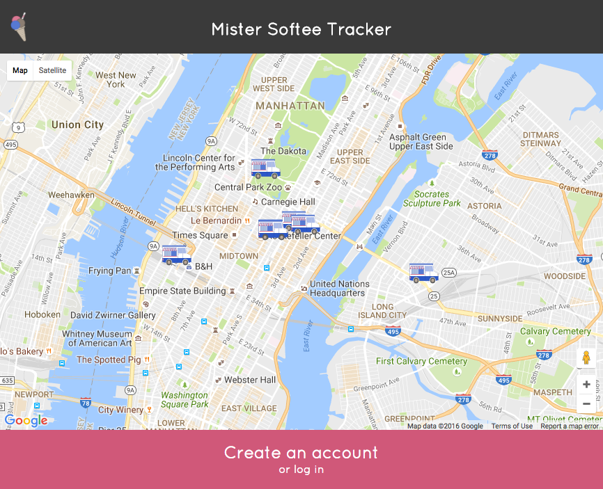

# Mister Softee Tracker

Live: https://mister-softee-tracker-client.herokuapp.com/

Everybody in New York knows the jingle of the Mister Softee ice cream trucks, though spotting one can feel like finding a unicorn. This app allows people to see real-time locations of Mister Softee trucks and make requests to drivers, while also allowing drivers to sign in and see where potential customers are.

This repo is the client app that I built using React and Redux. The Rails API that I built to handle the data for this app is located here: https://github.com/erikwithuhk/mister-softee-tracker-api.

## User Flow

#### Logged-Out User

When a user first arrives at the app and is not logged in, the browser makes a request for the user's location, and then re-centers the map to show where the Mister Softee truck drivers in their area are located.

In order to access additional features, they must first create an account or log in.

#### Logged-In Customer

#### Logged-In Vendor
